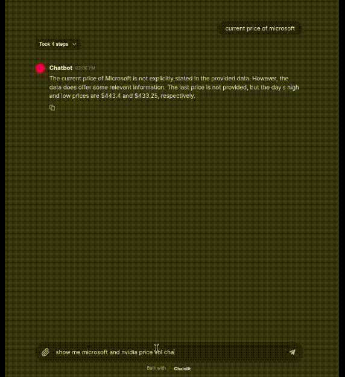

# Quant Chatbot with Function Calling

<div style="text-align: center;">
  
</div>

This project implements a chatbot that utilizes Yahoo Finance data to aid quantitative analysts. We use the Groq API (https://groq.com) Llama3-70B model with function calling.

## Environment Variables

Make sure to set the following environment variables:

- `GROQ_API_KEY`: API key for accessing the Groq service. Obtain this key from [Groq API](https://console.groq.com/keys).

Optional environment variables for LLM tracing:

- `LANGCHAIN_TRACING_V2`: Enable LangChain tracing. Set it to `true` to activate tracing.
- `LANGCHAIN_ENDPOINT`: Endpoint for the LangChain API. Set it to `https://api.smith.langchain.com`.
- `LANGCHAIN_API_KEY`: API key for accessing the LangChain service. Obtain this key from [Langchain API](https://smith.langchain.com/).
- `LANGCHAIN_PROJECT`: The project ID for your LangChain project. Find this information in your LangChain project settings.

## Installation

Use pip to install the required dependencies:

```bash
pip install -r requirements.txt
```

## Usage

To run the assistant, execute:

```bash
chainlit run main.py
```


## License

This project is licensed under the MIT License

## References
You can find the original project at [Yahoo Finance Assistant](https://github.com/kimnt93/quantcb).
